# Milestone Brief: 3.0

- Generated: 2026-02-17T04:43:30.976Z
- Engine target: godot_4.5
- Project type: 2d_topdown_shooter_action_rpg
- Focus: 3.0
- Depth: 2

## Graph

```mermaid
flowchart TD
  S_1_0["1.0 Foundation & Workflow"]
  class S_1_0 notstarted;
  S_1_4["1.4 Configure dual-pane UI shell"]
  class S_1_4 notstarted;
  S_2_0["2.0 Core Shooter Template"]
  class S_2_0 notstarted;
  S_2_1["2.1 Create Main scene and canonical node tree"]
  class S_2_1 notstarted;
  S_2_2["2.2 Implement player movement (8-direction top-down)"]
  class S_2_2 notstarted;
  S_2_3["2.3 Implement camera follow"]
  class S_2_3 notstarted;
  S_2_4["2.4 Implement basic shooting"]
  class S_2_4 notstarted;
  S_2_5["2.5 Enemy basic AI + health/death"]
  class S_2_5 notstarted;
  S_2_6["2.6 HUD (health and combat indicators)"]
  class S_2_6 notstarted;
  S_2_7["2.7 Section 2 integration validation"]
  class S_2_7 notstarted;
  S_3_0["3.0 Action RPG Layer"]
  class S_3_0 notstarted;
  class S_3_0 focus;
  S_3_1["3.1 NPC interaction framework"]
  class S_3_1 notstarted;
  S_3_2["3.2 Dialogue data structure"]
  class S_3_2 notstarted;
  S_3_3["3.3 Quest state machine"]
  class S_3_3 notstarted;
  S_3_4["3.4 Loot and inventory basic"]
  class S_3_4 notstarted;
  S_3_5["3.5 Save/load checkpoint v1"]
  class S_3_5 notstarted;
  S_3_6["3.6 Section 3 integration validation"]
  class S_3_6 notstarted;
  S_4_0["4.0 Dungeon Crawler Layer"]
  class S_4_0 notstarted;
  S_4_1["4.1 Room state model"]
  class S_4_1 notstarted;
  S_4_2["4.2 Spawn wave director"]
  class S_4_2 notstarted;
  S_4_3["4.3 Clear-room gates and transitions"]
  class S_4_3 notstarted;
  S_4_4["4.4 Dungeon run completion"]
  class S_4_4 notstarted;
  S_4_5["4.5 Section 4 integration validation"]
  class S_4_5 notstarted;
  S_5_0["5.0 Asset, UI, and World Pipeline"]
  class S_5_0 notstarted;
  S_1_0 --> S_1_4:::hierarchy
  S_2_0 --> S_2_1:::hierarchy
  S_2_0 --> S_2_2:::hierarchy
  S_2_0 --> S_2_3:::hierarchy
  S_2_0 --> S_2_4:::hierarchy
  S_2_0 --> S_2_5:::hierarchy
  S_2_0 --> S_2_6:::hierarchy
  S_2_0 --> S_2_7:::hierarchy
  S_3_0 --> S_3_1:::hierarchy
  S_3_0 --> S_3_2:::hierarchy
  S_3_0 --> S_3_3:::hierarchy
  S_3_0 --> S_3_4:::hierarchy
  S_3_0 --> S_3_5:::hierarchy
  S_3_0 --> S_3_6:::hierarchy
  S_4_0 --> S_4_1:::hierarchy
  S_4_0 --> S_4_2:::hierarchy
  S_4_0 --> S_4_3:::hierarchy
  S_4_0 --> S_4_4:::hierarchy
  S_4_0 --> S_4_5:::hierarchy
  S_1_0 -. dep .-> S_2_0:::dependency
  S_1_4 -. dep .-> S_2_1:::dependency
  S_2_1 -. dep .-> S_2_2:::dependency
  S_2_2 -. dep .-> S_2_3:::dependency
  S_2_2 -. dep .-> S_2_4:::dependency
  S_2_4 -. dep .-> S_2_5:::dependency
  S_2_5 -. dep .-> S_2_6:::dependency
  S_2_6 -. dep .-> S_2_7:::dependency
  S_2_0 -. dep .-> S_3_0:::dependency
  S_2_7 -. dep .-> S_3_1:::dependency
  S_3_1 -. dep .-> S_3_2:::dependency
  S_3_2 -. dep .-> S_3_3:::dependency
  S_3_3 -. dep .-> S_3_4:::dependency
  S_3_4 -. dep .-> S_3_5:::dependency
  S_3_5 -. dep .-> S_3_6:::dependency
  S_3_0 -. dep .-> S_4_0:::dependency
  S_3_6 -. dep .-> S_4_1:::dependency
  S_4_1 -. dep .-> S_4_2:::dependency
  S_4_2 -. dep .-> S_4_3:::dependency
  S_4_3 -. dep .-> S_4_4:::dependency
  S_4_4 -. dep .-> S_4_5:::dependency
  S_4_0 -. dep .-> S_5_0:::dependency
  S_1_0 -->|next| S_2_0:::nextptr
  S_1_4 -->|next| S_2_0:::nextptr
  S_2_0 -->|next| S_3_0:::nextptr
  S_2_1 -->|next| S_2_2:::nextptr
  S_2_2 -->|next| S_2_3:::nextptr
  S_2_3 -->|next| S_2_4:::nextptr
  S_2_4 -->|next| S_2_5:::nextptr
  S_2_5 -->|next| S_2_6:::nextptr
  S_2_6 -->|next| S_2_7:::nextptr
  S_2_7 -->|next| S_3_0:::nextptr
  S_3_0 -->|next| S_4_0:::nextptr
  S_3_1 -->|next| S_3_2:::nextptr
  S_3_2 -->|next| S_3_3:::nextptr
  S_3_3 -->|next| S_3_4:::nextptr
  S_3_4 -->|next| S_3_5:::nextptr
  S_3_5 -->|next| S_3_6:::nextptr
  S_3_6 -->|next| S_4_0:::nextptr
  S_4_0 -->|next| S_5_0:::nextptr
  S_4_1 -->|next| S_4_2:::nextptr
  S_4_2 -->|next| S_4_3:::nextptr
  S_4_3 -->|next| S_4_4:::nextptr
  S_4_4 -->|next| S_4_5:::nextptr
  S_4_5 -->|next| S_5_0:::nextptr
  classDef complete fill:#1f6f3f,color:#fff,stroke:#14522d,stroke-width:1px;
  classDef inprogress fill:#1f4f8b,color:#fff,stroke:#163a66,stroke-width:1px;
  classDef blocked fill:#8b1f2d,color:#fff,stroke:#661621,stroke-width:1px;
  classDef notstarted fill:#555,color:#fff,stroke:#333,stroke-width:1px;
  classDef dependency stroke-dasharray: 5 5;
  classDef nextptr stroke-width:2px;
  classDef hierarchy stroke-width:1px;
  classDef focus stroke:#ffd166,stroke-width:3px;
```

## Summary

- Total sections in manifest: **38**
- Included in this brief: **24**
- Complete: **0**
- In progress: **0**
- Blocked: **0**
- Not started: **38**

## Ready Now (included scope)

- 1.0 Foundation & Workflow

## Included Sections

| ID | Title | Status | Parent | Dependencies | Next |
|---|---|---|---|---|---|
| 1.0 | Foundation & Workflow | not_started | - | - | 2.0 |
| 1.4 | Configure dual-pane UI shell | not_started | 1.0 | 1.3 | 2.0 |
| 2.0 | Core Shooter Template | not_started | - | 1.0 | 3.0 |
| 2.1 | Create Main scene and canonical node tree | not_started | 2.0 | 1.4 | 2.2 |
| 2.2 | Implement player movement (8-direction top-down) | not_started | 2.0 | 2.1, 1.2 | 2.3 |
| 2.3 | Implement camera follow | not_started | 2.0 | 2.2 | 2.4 |
| 2.4 | Implement basic shooting | not_started | 2.0 | 2.2 | 2.5 |
| 2.5 | Enemy basic AI + health/death | not_started | 2.0 | 2.4 | 2.6 |
| 2.6 | HUD (health and combat indicators) | not_started | 2.0 | 2.5 | 2.7 |
| 2.7 | Section 2 integration validation | not_started | 2.0 | 2.6 | 3.0 |
| 3.0 | Action RPG Layer | not_started | - | 2.0 | 4.0 |
| 3.1 | NPC interaction framework | not_started | 3.0 | 2.7 | 3.2 |
| 3.2 | Dialogue data structure | not_started | 3.0 | 3.1 | 3.3 |
| 3.3 | Quest state machine | not_started | 3.0 | 3.2 | 3.4 |
| 3.4 | Loot and inventory basic | not_started | 3.0 | 3.3 | 3.5 |
| 3.5 | Save/load checkpoint v1 | not_started | 3.0 | 3.4 | 3.6 |
| 3.6 | Section 3 integration validation | not_started | 3.0 | 3.5 | 4.0 |
| 4.0 | Dungeon Crawler Layer | not_started | - | 3.0 | 5.0 |
| 4.1 | Room state model | not_started | 4.0 | 3.6 | 4.2 |
| 4.2 | Spawn wave director | not_started | 4.0 | 4.1 | 4.3 |
| 4.3 | Clear-room gates and transitions | not_started | 4.0 | 4.2 | 4.4 |
| 4.4 | Dungeon run completion | not_started | 4.0 | 4.3 | 4.5 |
| 4.5 | Section 4 integration validation | not_started | 4.0 | 4.4 | 5.0 |
| 5.0 | Asset, UI, and World Pipeline | not_started | - | 4.0 | 6.0 |

## Blockers (included scope)

| Section | Blocker |
|---|---|
| 1.0 | Checklist not passing: 1.0.c1 (not_started) |
| 1.4 | Dependency not complete: 1.3 (not_started) |
| 1.4 | Checklist not passing: 1.4.c1 (not_started) |
| 1.4 | Checklist not passing: 1.4.c2 (not_started) |
| 1.4 | Checklist not passing: 1.4.c3 (not_started) |
| 1.4 | Checklist not passing: 1.4.c4 (not_started) |
| 2.0 | Dependency not complete: 1.0 (not_started) |
| 2.0 | Checklist not passing: 2.0.c1 (not_started) |
| 2.0 | Checklist not passing: 2.0.c2 (not_started) |
| 2.1 | Dependency not complete: 1.4 (not_started) |
| 2.1 | Checklist not passing: 2.1.c1 (not_started) |
| 2.1 | Checklist not passing: 2.1.c2 (not_started) |
| 2.1 | Checklist not passing: 2.1.c3 (not_started) |
| 2.2 | Dependency not complete: 2.1 (not_started) |
| 2.2 | Dependency not complete: 1.2 (not_started) |
| 2.2 | Checklist not passing: 2.2.c1 (not_started) |
| 2.2 | Checklist not passing: 2.2.c2 (not_started) |
| 2.2 | Checklist not passing: 2.2.c3 (not_started) |
| 2.3 | Dependency not complete: 2.2 (not_started) |
| 2.3 | Checklist not passing: 2.3.c1 (not_started) |
| 2.3 | Checklist not passing: 2.3.c2 (not_started) |
| 2.4 | Dependency not complete: 2.2 (not_started) |
| 2.4 | Checklist not passing: 2.4.c1 (not_started) |
| 2.4 | Checklist not passing: 2.4.c2 (not_started) |
| 2.4 | Checklist not passing: 2.4.c3 (not_started) |
| 2.5 | Dependency not complete: 2.4 (not_started) |
| 2.5 | Checklist not passing: 2.5.c1 (not_started) |
| 2.5 | Checklist not passing: 2.5.c2 (not_started) |
| 2.5 | Checklist not passing: 2.5.c3 (not_started) |
| 2.6 | Dependency not complete: 2.5 (not_started) |
| 2.6 | Checklist not passing: 2.6.c1 (not_started) |
| 2.6 | Checklist not passing: 2.6.c2 (not_started) |
| 2.7 | Dependency not complete: 2.6 (not_started) |
| 2.7 | Checklist not passing: 2.7.c1 (not_started) |
| 2.7 | Checklist not passing: 2.7.c2 (not_started) |
| 2.7 | Checklist not passing: 2.7.c3 (not_started) |
| 3.0 | Dependency not complete: 2.0 (not_started) |
| 3.0 | Checklist not passing: 3.0.c1 (not_started) |
| 3.0 | Checklist not passing: 3.0.c2 (not_started) |
| 3.1 | Dependency not complete: 2.7 (not_started) |
| 3.1 | Checklist not passing: 3.1.c1 (not_started) |
| 3.1 | Checklist not passing: 3.1.c2 (not_started) |
| 3.2 | Dependency not complete: 3.1 (not_started) |
| 3.2 | Checklist not passing: 3.2.c1 (not_started) |
| 3.2 | Checklist not passing: 3.2.c2 (not_started) |
| 3.3 | Dependency not complete: 3.2 (not_started) |
| 3.3 | Checklist not passing: 3.3.c1 (not_started) |
| 3.3 | Checklist not passing: 3.3.c2 (not_started) |
| 3.3 | Checklist not passing: 3.3.c3 (not_started) |
| 3.4 | Dependency not complete: 3.3 (not_started) |
| 3.4 | Checklist not passing: 3.4.c1 (not_started) |
| 3.4 | Checklist not passing: 3.4.c2 (not_started) |
| 3.4 | Checklist not passing: 3.4.c3 (not_started) |
| 3.5 | Dependency not complete: 3.4 (not_started) |
| 3.5 | Checklist not passing: 3.5.c1 (not_started) |
| 3.5 | Checklist not passing: 3.5.c2 (not_started) |
| 3.5 | Checklist not passing: 3.5.c3 (not_started) |
| 3.6 | Dependency not complete: 3.5 (not_started) |
| 3.6 | Checklist not passing: 3.6.c1 (not_started) |
| 3.6 | Checklist not passing: 3.6.c2 (not_started) |
| 3.6 | Checklist not passing: 3.6.c3 (not_started) |
| 4.0 | Dependency not complete: 3.0 (not_started) |
| 4.0 | Checklist not passing: 4.0.c1 (not_started) |
| 4.0 | Checklist not passing: 4.0.c2 (not_started) |
| 4.1 | Dependency not complete: 3.6 (not_started) |
| 4.1 | Checklist not passing: 4.1.c1 (not_started) |
| 4.1 | Checklist not passing: 4.1.c2 (not_started) |
| 4.2 | Dependency not complete: 4.1 (not_started) |
| 4.2 | Checklist not passing: 4.2.c1 (not_started) |
| 4.2 | Checklist not passing: 4.2.c2 (not_started) |
| 4.2 | Checklist not passing: 4.2.c3 (not_started) |
| 4.3 | Dependency not complete: 4.2 (not_started) |
| 4.3 | Checklist not passing: 4.3.c1 (not_started) |
| 4.3 | Checklist not passing: 4.3.c2 (not_started) |
| 4.3 | Checklist not passing: 4.3.c3 (not_started) |
| 4.4 | Dependency not complete: 4.3 (not_started) |
| 4.4 | Checklist not passing: 4.4.c1 (not_started) |
| 4.4 | Checklist not passing: 4.4.c2 (not_started) |
| 4.5 | Dependency not complete: 4.4 (not_started) |
| 4.5 | Checklist not passing: 4.5.c1 (not_started) |
| 4.5 | Checklist not passing: 4.5.c2 (not_started) |
| 4.5 | Checklist not passing: 4.5.c3 (not_started) |
| 5.0 | Dependency not complete: 4.0 (not_started) |
| 5.0 | Checklist not passing: 5.0.c1 (not_started) |
| 5.0 | Checklist not passing: 5.0.c2 (not_started) |

## Artifact Source

- src/data/artifacts_manifest.json

## Artifact Completeness Summary

- Included sections audited: **24**
- Sections with all required final artifacts: **1**
- Missing required artifact entries: **83**
- Final artifacts in scope: **3**

## Artifact Status by Section

| Section | Required Types | Final Types Present | Missing Required Types | Final/Total | Completeness |
|---|---|---|---|---|---|
| 1.0 | task_packet, check_report, memory_entry | task_packet, check_report, memory_entry | - | 3/3 | 100% |
| 1.4 | task_packet, ui_wireframe, check_report, memory_entry | - | task_packet, ui_wireframe, check_report, memory_entry | 0/0 | 0% |
| 2.0 | check_report, memory_entry | - | check_report, memory_entry | 0/0 | 0% |
| 2.1 | task_packet, scene_contract_report, check_report, memory_entry | - | task_packet, scene_contract_report, check_report, memory_entry | 0/0 | 0% |
| 2.2 | task_packet, patch_summary, check_report, memory_entry, tutorial_note | - | task_packet, patch_summary, check_report, memory_entry, tutorial_note | 0/0 | 0% |
| 2.3 | task_packet, patch_summary, check_report, memory_entry | - | task_packet, patch_summary, check_report, memory_entry | 0/0 | 0% |
| 2.4 | task_packet, patch_summary, check_report, memory_entry | - | task_packet, patch_summary, check_report, memory_entry | 0/0 | 0% |
| 2.5 | task_packet, patch_summary, check_report, memory_entry | - | task_packet, patch_summary, check_report, memory_entry | 0/0 | 0% |
| 2.6 | task_packet, patch_summary, check_report, memory_entry, ui_wireframe | - | task_packet, patch_summary, check_report, memory_entry, ui_wireframe | 0/0 | 0% |
| 2.7 | check_report, memory_entry | - | check_report, memory_entry | 0/0 | 0% |
| 3.0 | check_report, memory_entry | - | check_report, memory_entry | 0/0 | 0% |
| 3.1 | task_packet, patch_summary, check_report, memory_entry, tutorial_note | - | task_packet, patch_summary, check_report, memory_entry, tutorial_note | 0/0 | 0% |
| 3.2 | task_packet, patch_summary, check_report, memory_entry | - | task_packet, patch_summary, check_report, memory_entry | 0/0 | 0% |
| 3.3 | task_packet, patch_summary, check_report, memory_entry, tutorial_note | - | task_packet, patch_summary, check_report, memory_entry, tutorial_note | 0/0 | 0% |
| 3.4 | task_packet, patch_summary, check_report, memory_entry | - | task_packet, patch_summary, check_report, memory_entry | 0/0 | 0% |
| 3.5 | task_packet, patch_summary, check_report, memory_entry | - | task_packet, patch_summary, check_report, memory_entry | 0/0 | 0% |
| 3.6 | check_report, memory_entry | - | check_report, memory_entry | 0/0 | 0% |
| 4.0 | check_report, memory_entry | - | check_report, memory_entry | 0/0 | 0% |
| 4.1 | task_packet, patch_summary, check_report, memory_entry | - | task_packet, patch_summary, check_report, memory_entry | 0/0 | 0% |
| 4.2 | task_packet, patch_summary, check_report, memory_entry | - | task_packet, patch_summary, check_report, memory_entry | 0/0 | 0% |
| 4.3 | task_packet, patch_summary, check_report, memory_entry | - | task_packet, patch_summary, check_report, memory_entry | 0/0 | 0% |
| 4.4 | task_packet, patch_summary, check_report, memory_entry | - | task_packet, patch_summary, check_report, memory_entry | 0/0 | 0% |
| 4.5 | check_report, memory_entry | - | check_report, memory_entry | 0/0 | 0% |
| 5.0 | check_report, memory_entry, asset_brief | - | check_report, memory_entry, asset_brief | 0/0 | 0% |

## Onboarding Notes

1. Start from **Ready Now** items first.
2. Resolve blockers before opening new in-progress branches.
3. Keep section artifacts complete (task packet, check report, memory entry minimum).
