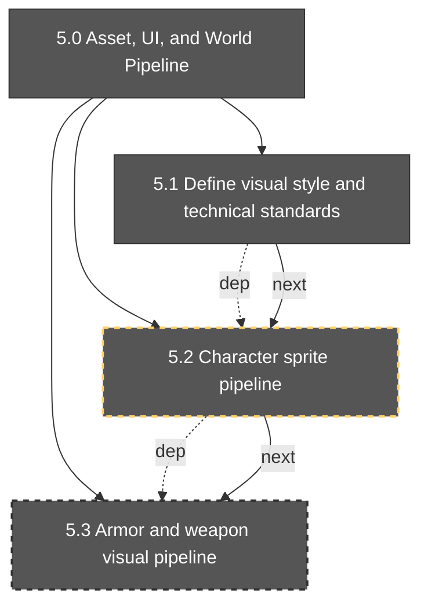

# Milestone Brief: 5.2

- Generated: 2026-02-17T04:29:42.489Z
- Engine target: godot_4.5
- Project type: 2d_topdown_shooter_action_rpg
- Focus: 5.2
- Depth: 1
- Artifacts source: src/data/artifacts_manifest.json

> ⚠️ Artifact manifest warning
>
> Could not load artifact manifest "src/data/artifacts_manifest.json": File not found: C:\Users\penus\ggd4.5\src\data\artifacts_manifest.json

## Graph

## Summary

- Total sections in manifest: **38**
- Included in this brief: **4**
- Complete: **0**
- In progress: **0**
- Blocked: **0**
- Not started: **38**

## Ready Now (included scope)

- None

## Included Sections

| ID | Title | Status | Parent | Dependencies | Next |
|---|---|---|---|---|---|
| 5.0 | Asset, UI, and World Pipeline | not_started | - | 4.0 | 6.0 |
| 5.1 | Define visual style and technical standards | not_started | 5.0 | 4.5 | 5.2 |
| 5.2 | Character sprite pipeline | not_started | 5.0 | 5.1 | 5.3 |
| 5.3 | Armor and weapon visual pipeline | not_started | 5.0 | 5.2 | 5.4 |

## Blockers (included scope)

| Section | Blocker |
|---|---|
| 5.0 | Dependency not complete: 4.0 (not_started) |
| 5.0 | Checklist not passing: 5.0.c1 (not_started) |
| 5.0 | Checklist not passing: 5.0.c2 (not_started) |
| 5.1 | Dependency not complete: 4.5 (not_started) |
| 5.1 | Checklist not passing: 5.1.c1 (not_started) |
| 5.1 | Checklist not passing: 5.1.c2 (not_started) |
| 5.1 | Checklist not passing: 5.1.c3 (not_started) |
| 5.2 | Dependency not complete: 5.1 (not_started) |
| 5.2 | Checklist not passing: 5.2.c1 (not_started) |
| 5.2 | Checklist not passing: 5.2.c2 (not_started) |
| 5.2 | Checklist not passing: 5.2.c3 (not_started) |
| 5.3 | Dependency not complete: 5.2 (not_started) |
| 5.3 | Checklist not passing: 5.3.c1 (not_started) |
| 5.3 | Checklist not passing: 5.3.c2 (not_started) |
| 5.3 | Checklist not passing: 5.3.c3 (not_started) |

## Onboarding Notes

1. Start from **Ready Now** items first.
2. Resolve blockers before opening new in-progress branches.
3. Keep section artifacts complete (task packet, check report, memory entry minimum).
