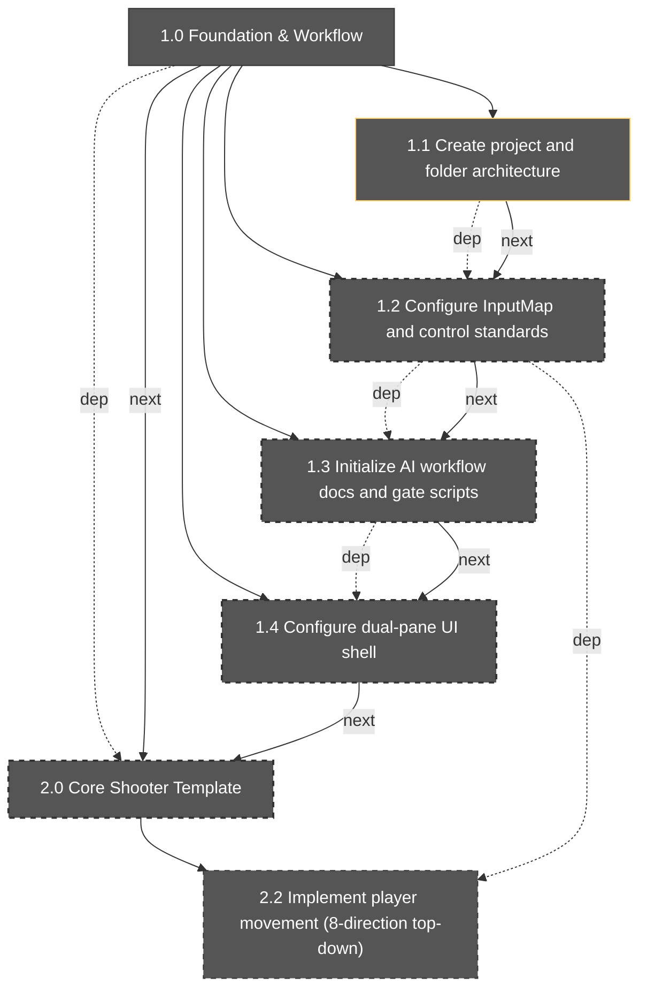

# Milestone Brief: 1.1

- Generated: 2026-02-17T07:41:10.545Z
- Engine target: godot_4.5
- Project type: 2d_topdown_shooter_action_rpg
- Focus: 1.1
- Depth: 2
- Artifacts source: src/data/artifacts_manifest.json

## Graph

## Summary

- Total sections in manifest: **38**
- Included in this brief: **7**
- Complete: **0**
- In progress: **0**
- Blocked: **0**
- Not started: **38**

## Ready Now (included scope)

- 1.0 Foundation & Workflow
- 1.1 Create project and folder architecture

## Included Sections

| ID | Title | Status | Parent | Dependencies | Next |
|---|---|---|---|---|---|
| 1.0 | Foundation & Workflow | not_started | - | - | 2.0 |
| 1.1 | Create project and folder architecture | not_started | 1.0 | - | 1.2 |
| 1.2 | Configure InputMap and control standards | not_started | 1.0 | 1.1 | 1.3 |
| 1.3 | Initialize AI workflow docs and gate scripts | not_started | 1.0 | 1.2 | 1.4 |
| 1.4 | Configure dual-pane UI shell | not_started | 1.0 | 1.3 | 2.0 |
| 2.0 | Core Shooter Template | not_started | - | 1.0 | 3.0 |
| 2.2 | Implement player movement (8-direction top-down) | not_started | 2.0 | 2.1, 1.2 | 2.3 |

## Blockers (included scope)

| Section | Blocker |
|---|---|
| 1.0 | Checklist not passing: 1.0.c1 (not_started) |
| 1.1 | Checklist not passing: 1.1.c1 (not_started) |
| 1.1 | Checklist not passing: 1.1.c2 (not_started) |
| 1.1 | Checklist not passing: 1.1.c3 (not_started) |
| 1.2 | Dependency not complete: 1.1 (not_started) |
| 1.2 | Checklist not passing: 1.2.c1 (not_started) |
| 1.2 | Checklist not passing: 1.2.c2 (not_started) |
| 1.2 | Checklist not passing: 1.2.c3 (not_started) |
| 1.3 | Dependency not complete: 1.2 (not_started) |
| 1.3 | Checklist not passing: 1.3.c1 (not_started) |
| 1.3 | Checklist not passing: 1.3.c2 (not_started) |
| 1.3 | Checklist not passing: 1.3.c3 (not_started) |
| 1.3 | Checklist not passing: 1.3.c4 (not_started) |
| 1.4 | Dependency not complete: 1.3 (not_started) |
| 1.4 | Checklist not passing: 1.4.c1 (not_started) |
| 1.4 | Checklist not passing: 1.4.c2 (not_started) |
| 1.4 | Checklist not passing: 1.4.c3 (not_started) |
| 1.4 | Checklist not passing: 1.4.c4 (not_started) |
| 2.0 | Dependency not complete: 1.0 (not_started) |
| 2.0 | Checklist not passing: 2.0.c1 (not_started) |
| 2.0 | Checklist not passing: 2.0.c2 (not_started) |
| 2.2 | Dependency not complete: 2.1 (not_started) |
| 2.2 | Dependency not complete: 1.2 (not_started) |
| 2.2 | Checklist not passing: 2.2.c1 (not_started) |
| 2.2 | Checklist not passing: 2.2.c2 (not_started) |
| 2.2 | Checklist not passing: 2.2.c3 (not_started) |

## Artifact Completeness Summary

- Included sections audited: **7**
- Sections with all required final artifacts: **7**
- Missing required artifact entries: **0**
- Final artifacts in scope: **26**

## Artifact Status by Section

| Section | Required Types | Final Types Present | Missing Required Types | Final/Total | Completeness |
|---|---|---|---|---|---|
| 1.0 | task_packet, check_report, memory_entry | task_packet, check_report, memory_entry | - | 3/3 | 100% |
| 1.1 | task_packet, check_report, memory_entry, tutorial_note | task_packet, check_report, memory_entry, tutorial_note | - | 4/4 | 100% |
| 1.2 | task_packet, check_report, memory_entry, tutorial_note | task_packet, check_report, memory_entry, tutorial_note | - | 4/4 | 100% |
| 1.3 | task_packet, patch_summary, check_report, memory_entry | task_packet, patch_summary, check_report, memory_entry | - | 4/4 | 100% |
| 1.4 | task_packet, ui_wireframe, check_report, memory_entry | task_packet, ui_wireframe, check_report, memory_entry | - | 4/4 | 100% |
| 2.0 | check_report, memory_entry | check_report, memory_entry | - | 2/2 | 100% |
| 2.2 | task_packet, patch_summary, check_report, memory_entry, tutorial_note | task_packet, patch_summary, check_report, memory_entry, tutorial_note | - | 5/5 | 100% |

## Onboarding Notes

1. Start with **Ready Now** sections first.
2. Clear blockers before opening new in-progress branches.
3. Keep minimum artifact coverage per section (task packet, check report, memory entry).
